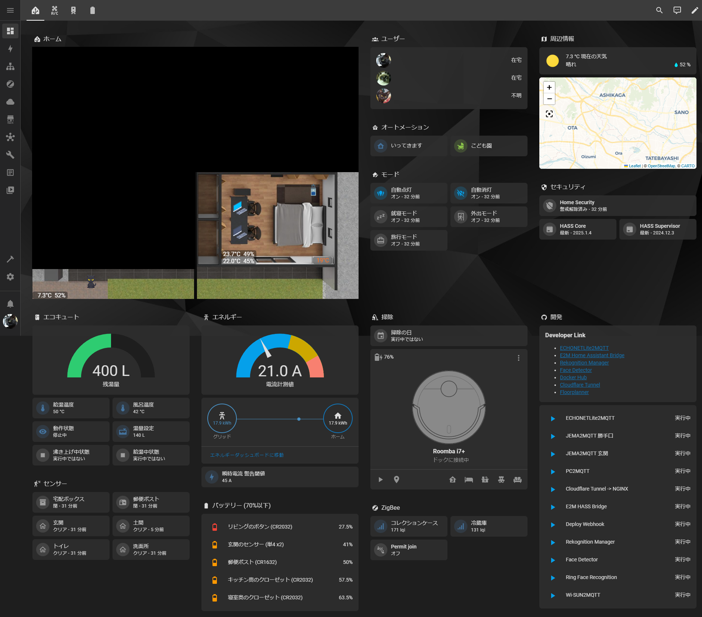

# Hi 🖖, I'm AKI

## 何してる人？

趣味と仕事の勉強を兼ねて、いろいろ作っています。  
仕事はJava/Kotlin+Spring Bootがメイン、趣味はTypeScriptがメインです。

<!-- https://github.com/anuraghazra/github-readme-stats/blob/master/docs/readme_ja.md -->

## さわったことがある

<!-- https://github.com/LelouchFR/skill-icons -->

### 言語

### フレームワーク / ライブラリ

### DB

### ツール

### インフラ

### OS

## スマートホームについて

自宅のダッシュボード

スキルとQOLの向上を目的にスマートホーム化を進めています。

基本は[Home Assistant](https://www.home-assistant.io/)と[Node-RED](https://nodered.org/)、足りない部分は自分で作ってます。

開発言語は主にTypeScriptで、動作環境は基本的にはRaspberry Pi 4 Model B、電子錠は簡単な自作回路を取り付けたRaspberry Pi Zero 2 Wを採用しています。
