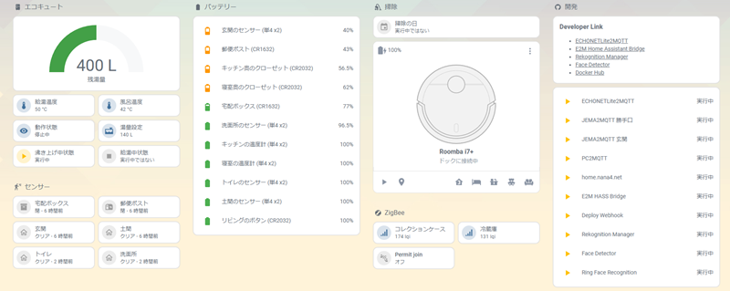

# nana4rider

こんにちは、はじめまして！

## 何やってる人？

趣味と仕事の勉強を兼ねて、いろいろ作ってます🐯  
仕事はJava/Kotlin+Spring Bootがメイン、趣味はTypeScriptがメインです。

## さわったことがある

<!-- https://github.com/tandpfun/skill-icons -->

### 言語

### フレームワーク / ライブラリ

### DB

### ツール

### インフラ

## スマートホームについて

我が家のダッシュボード

スキルとQOLの向上を目的にスマートホーム化を進めています。

基本は[Home Assistant](https://www.home-assistant.io/)と[Node-RED](https://nodered.org/)、足りない部分は自分で作ってます。

開発言語は主にTypeScriptで、動作環境は基本的にはRaspberry Pi 4 Model B、電子錠は簡単な自作回路を取り付けたRaspberry Pi Zeroを採用しています。

## 主な成果物

- [JEMA2MQTT](https://github.com/nana4rider/jema2mqtt)  
  JEM-A端子をGPIOに接続し、MQTT、Home Assistantで操作するためのアプリケーション

- [ECHONETLite2MQTT Home Assistant Bridge](https://github.com/nana4rider/e2m-hass-bridge)  
  ECHONETLite2MQTTで検出されたデバイスを、Home Assistantのデバイスとして自動検出させるためのアプリケーション

- [PC2MQTT](https://github.com/nana4rider/pc2mqtt)  
  パソコンをHome Assistantのスイッチデバイスとして自動検出させるためのアプリケーション

- [Ring Face Recognition](https://github.com/nana4rider/ring-face-recognition)  
  Ring Doorbellで顔認識するためのアプリケーション