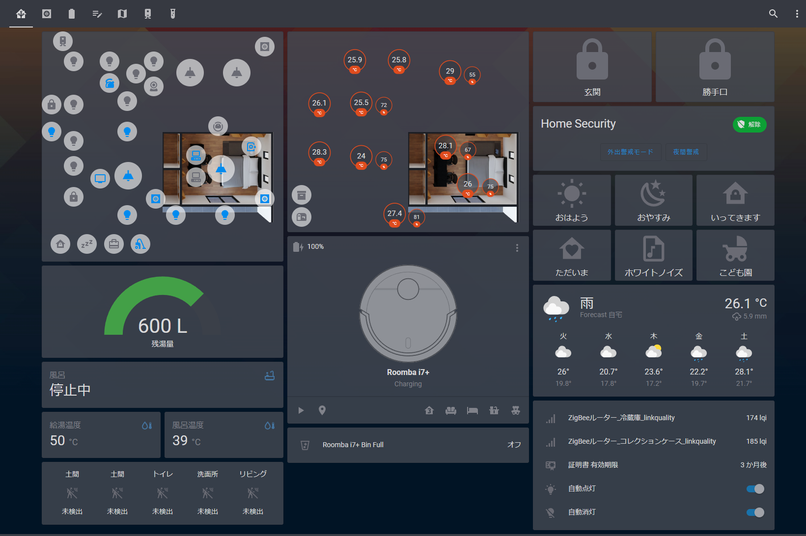
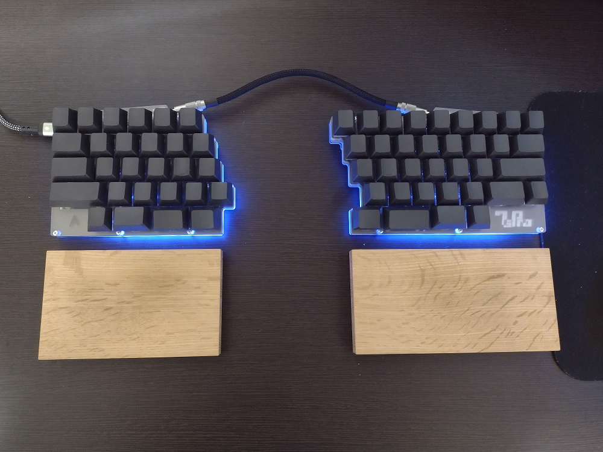

### 何やってる人？

趣味と仕事の勉強を兼ねて、いろいろ作ってる人です😹

  
  

### スマートホーム化への取り組み

2020年に家を建て、技術力とQOLの向上を目的にスマートホーム化を進めています。

[電子錠](https://github.com/nana4rider/jema-web-api)、[パソコン](https://github.com/nana4rider/remote-switch)、[エアコン](https://github.com/nana4rider/eolia-web-api)、テレビ([リモコン](https://github.com/nana4rider/viera-web-controller)/[API](https://github.com/nana4rider/viera-web-api))、温湿度、照明等を[Home Assistant](https://www.home-assistant.io/)で一元管理しています。

また、Alexaスキルを作成しEcho端末を各部屋に配置することにより、音声による操作も快適にしています。

### キーボードについて

|部品|購入品|
| :- | :- |
|本体|[7sPro](https://shop.yushakobo.jp/products/7spro)|
|キースイッチ|[Sakurio](https://shop.yushakobo.jp/products/pink-roselios-sakurios-silent-linear-limited-edition?variant=37665264894113)|
|キースイッチフィルム|[DUROCK](https://talpkeyboard.net/items/6002dc17da019c4f99dd4e35)|
|潤滑剤|[Tribosys 3204](https://shop.yushakobo.jp/products/lubricants)
|スタビライザー|[DUROCK V2 2U](https://talpkeyboard.net/items/6115111f2b2d3d1768766ac8)|
|キーキャップ|[EPBT INK BLANK PBT KEYCAPS](https://kbdfans.com/products/epbt-new-blank-keycaps?variant=39619112894603)|
|筐体|[アクリル(マットクリア)](https://shop.yushakobo.jp/products/keyboard_acrylic_plate)|
|パームレスト|[楢(オーダーメイド)](https://ja.wikipedia.org/wiki/%E3%83%8A%E3%83%A9)|
|滑り止め|[Griiip!](https://www.amazon.co.jp/dp/B0749CM2Z6)|

<!--
**nana4rider/nana4rider** is a ✨ _special_ ✨ repository because its `README.md` (this file) appears on your GitHub profile.

Here are some ideas to get you started:

- 🔭 I’m currently working on ...
- 🌱 I’m currently learning ...
- 👯 I’m looking to collaborate on ...
- 🤔 I’m looking for help with ...
- 💬 Ask me about ...
- 📫 How to reach me: ...
- 😄 Pronouns: ...
- ⚡ Fun fact: ...
-->
